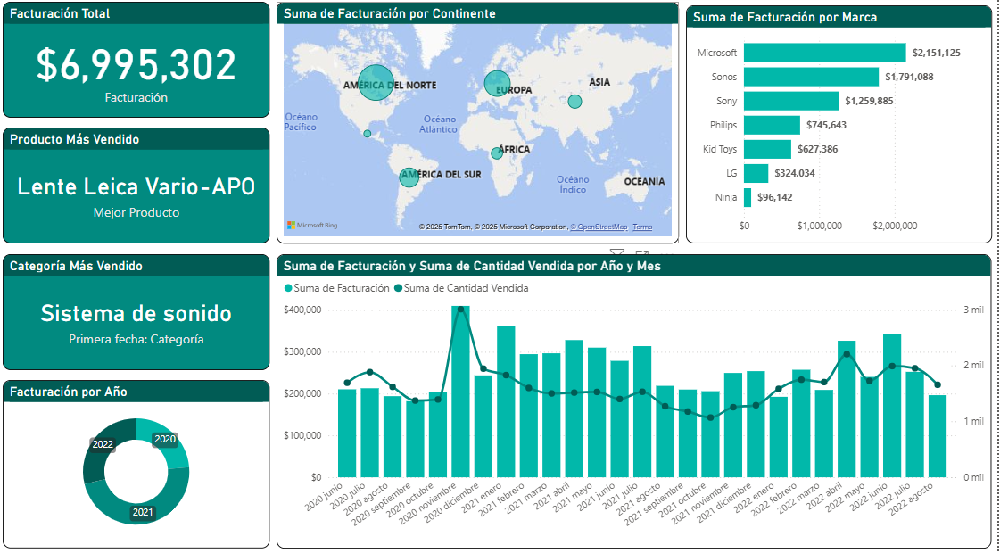
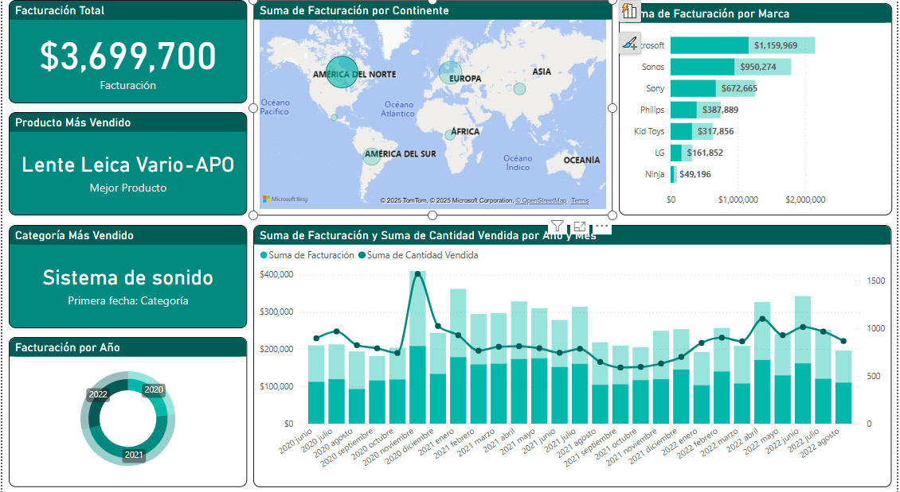
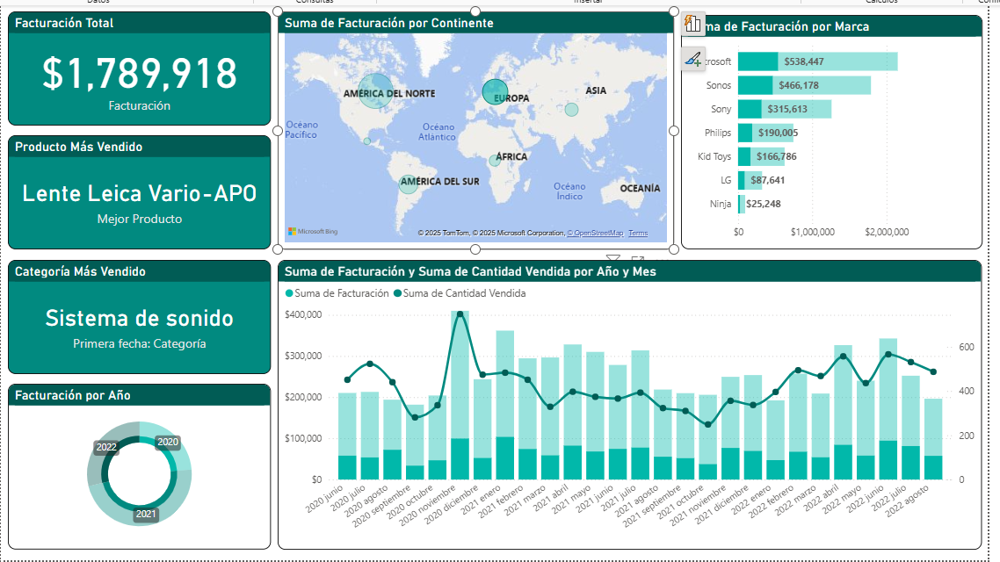
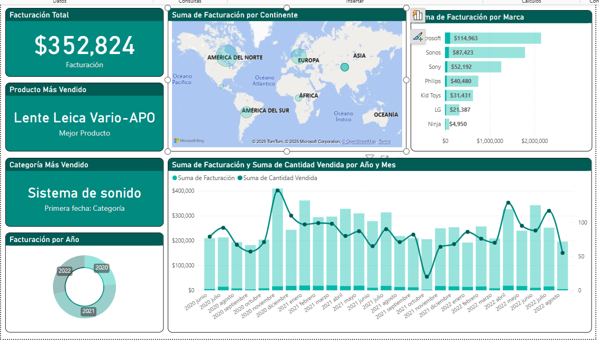

# 📊 Análisis de Ventas de Tecnología

## 📝 Descripción 

Este proyecto fue desarrollado en Power BI como ejercicio de análisis de ventas del sector tecnológico.  
A partir de un conjunto de datos de ventas, se generaron visualizaciones interactivas para evaluar el desempeño comercial por producto, categoría, región y tiempo.

## 🧠 Objetivo del análisis

- Identificar productos más vendidos  
- Comparar ventas por región y categoría  
- Evaluar desempeño mensual y trimestral  
- Facilitar decisiones estratégicas basadas en datos  

---

## 🛠️ Herramientas utilizadas

- **Power BI Desktop** (visualización y modelado)  
- **DAX** (cálculos de KPIs)  
- Segmentadores por **categoría**, **mes**, **año** y **región**
- **Excel** (fuente de datos original)

----
## 📸Vista Previa 

----

## 📸 Capturas de Pantalla

| Visualización | Descripción |
|---------------|-------------|
|   | Visión general del desempeño de ventas |
|   | Análisis de ventas en la Région Norte. |
|   | Análisis de ventas en Europa |
|   | Análisis de ventas en Asia |
|   | Desglose de ventas año 2020 |
|   | Desgolose de ventas año 2021 |
|  | Desglose de ventas año 2022 |

---

## 📂 Archivos

- `Ventas_Tech.pbix` : archivo original del dashboard  
- Carpeta './image:' capturas de pantalla para previsualización

## ✅ Principales hallazgos

- Las **categorías A y C** concentran más del 70% de las ventas totales. 
----------------------------- 
| Categoría   | % de ventas |
|-------------|-------------|
| Categoría A | 40%         |
| Categoría C | 32%         |
| Categoría B | 28%         |
-----------------------------
- **Región Centro** presenta el mayor volumen de ventas.  
- Hay una clara tendencia de crecimiento en el último trimestre del año.

- **KPIs** 
-------------------------------
| KPI             | Resultado |
|-----------------|-----------|
| Ventas Totales  | $2,500,000 |
| Productos vendidos | 18,000 unidades |
| Crecimiento anual | 12% |
---------------------------

## 🚀 Como abrir el proyecto

1. Instalar **Power BI Desktop** (descarga gratuita en [Microsoft Store](https://apps.microsoft.com/store/detail/power-bi-desktop/9NTXR16HNW1T)).
2. Clonar o descargar este repositorio.
3. Abrir el archivo `Ventas_Tech.pbix` desde Power BI Desktop.

---

## 📬 Contacto

- [LinkedIn](https://www.linkedin.com/in/alejandro-arellano-camacho/)  
- luis.alex.2711@gmail.com